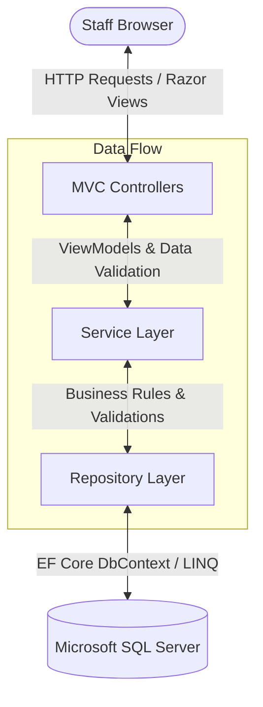

# Inventory Management System

A robust, enterprise-grade **Inventory Management System** built with **C#**, **ASP.NET Core MVC (.NET 10)**, **Entity Framework Core (EF Core)**, and **Microsoft SQL Server**.

This application is designed with a professional, responsive user interface and implements custom authentication, Master records management, and Stock Receipt tracking with strict business validation and auto-audit logs.

---

## 📐 System Architecture Flow

The project is structured using the **Service-Repository Pattern** to decouple database interactions from business rules and controllers. Here is the architecture flow diagram:



### Folder Structure
* 📂 **`Controllers/`**: Manages incoming requests, cookie session claims, and maps ViewModels to Razor views.
* 📂 **`Services/`**: Enforces business validation rules (such as blocking future dates and validating receipt quantities).
* 📂 **`Repositories/`**: Manages CRUD database queries using EF Core with custom relations (e.g., eager-loading related tables).
* 📂 **`Models/`**: Defines database tables/schemas and validation annotations.
* 📂 **`ViewModels/`**: Structured data contracts used to transport form input safely between views and controllers.
* 📂 **`Views/`**: Responsive Bootstrap 5 Razor views designed with a slate-minimalist color theme.
* 📂 **`db/`**: SQL scripts for schema initialization and database seeding.

---

## 🔒 Business & Audit Rules

1. **User Authentication:** Custom cookie-based authentication. Passwords are encrypted in SQL Server using the standard **BCrypt** hashing algorithm.
2. **Auto-Audit Logging:** Creating or editing records automatically captures the active user's username (`CreatedBy`) and the current timestamp (`CreatedOn`) from the session claims.
3. **Strict Quantity Validations:** Stock receipt quantities are validated both client-side and server-side to ensure they are strictly greater than 0.
4. **No Future Dates:** Receipt dates are restricted to today or earlier. Future dates are disabled in the calendar picker and rejected on the server.
5. **Alphabetical Sorting:** All master lists in dropdown selections are automatically sorted alphabetically (Vendors by `FirstName`, Projects by `ProjectName`, Items by `ItemName`).

---

## 🚀 How to Run the Project Locally

### Step 1: Set Up the Database
1. Open **SQL Server Management Studio (SSMS)** and connect to your local database engine:
   * **Server name:** `localhost\SQLEXPRESS`
   * **Authentication:** `Windows Authentication` (or SQL Authentication with `sa` / `Password_123!`)
2. Open the file [db/setup_inventory_db.sql](db/setup_inventory_db.sql) and click **Execute** (or press **F5**). 
   * *This unified script automatically creates the `UserManagementDB` database, configures the tables, builds performance indexes, and seeds test data.*

### Step 2: Build and Launch the Web Application
1. Open your terminal or Command Prompt.
2. Navigate to the project root directory:
   ```cmd
   cd C:\Users\shris\work\INTERN-backend
   ```
3. Run the application:
   ```cmd
   dotnet run
   ```
4. Open your web browser and go to:
   👉 **`http://localhost:5000`**

### Step 3: Login Credentials
To test the portal, log in using the pre-seeded admin user details:
* **Username:** `sanjay326`
* **Password:** `Password123!`

---

## 💻 Tech Stack
* **Framework:** ASP.NET Core 10.0 (MVC)
* **Data Access:** EF Core (SQL Server Provider)
* **Encryption:** BCrypt.Net-Next
* **Front-end UI:** HTML5, CSS3, Bootstrap 5.3 (Slate Theme), FontAwesome 6
* **Database:** Microsoft SQL Server Express
